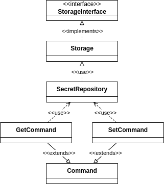

# My Secret Vault Command

## User documentation

### Set command

    Usage:
    php bin/console.php app:set <key> <value>

    Arguments:
    key                   Key of the secret
    value                 Value of the secret

### Get command

    Usage:
    php bin/console.php app:get <key>

    Arguments:
    key                   Key of the secret

## Developers documentation

### Class Diagram

